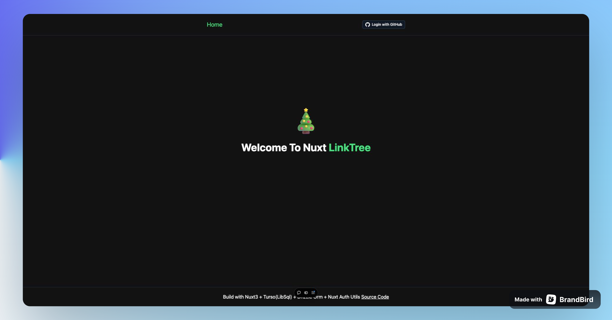
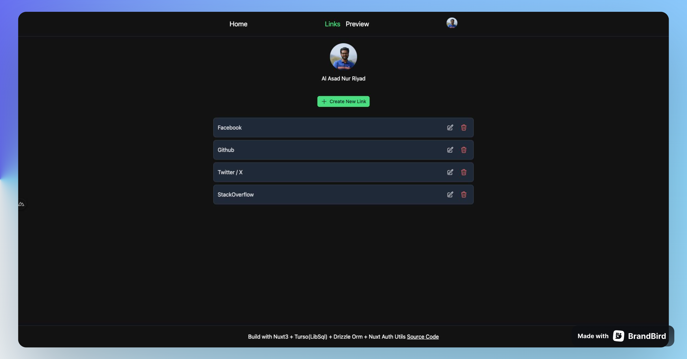
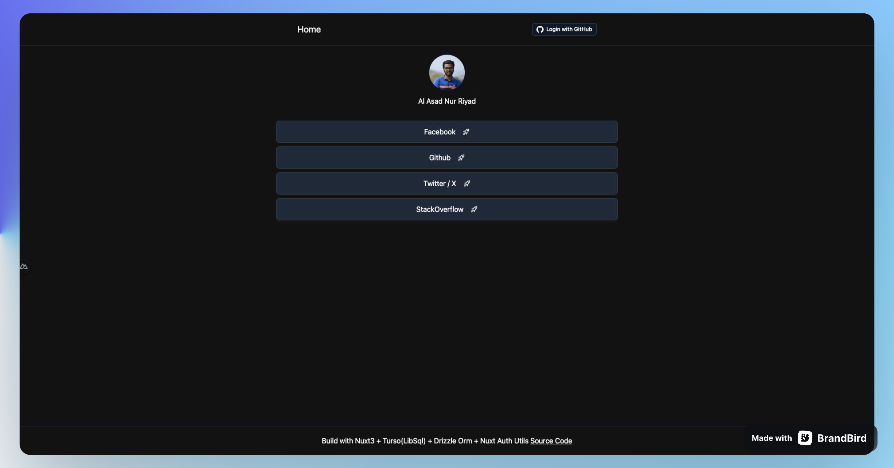

# LinkTree

Easily share all your links at once.

### Built with

- Nuxt 3, Github OAuth LibSQL, Vercel,

### Preview

<p align="center">
  <a href="https://hnews-nurriyad.netlify.com" target="_blank">
    
    
    
    <br>
    Live Demo
  </a>
</p>

## Demo

https://hnews-nurriyad.netlify.app/

> Hosted on [Netlify](https://netlify.com/): `npm run build`

## Features

- Server Side Rendering
- Login With Github
- Easily Share all your link

Make sure to install dependencies:

## Production

Build the application for production:

```bash
# npm
npm run build

# pnpm
pnpm build

# yarn
yarn build

# bun
bun run build
```

Locally preview production build:

```bash
# npm
npm run preview

# pnpm
pnpm preview

# yarn
yarn preview

# bun
bun run preview
```

Check out the [deployment documentation](https://nuxt.com/docs/getting-started/deployment) for more information.
