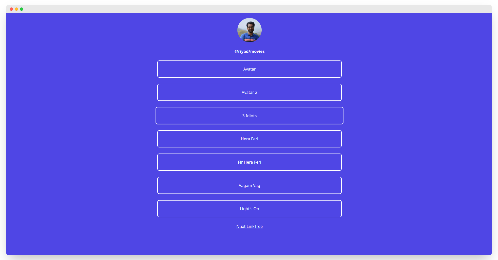

# Nuxt LinkTree
This web app is a platform that allows users to create and share their own lists of their top 20 items in various categories such as songs, movies, or anime. The technology stack used for building this app includes Nuxt.js version 3, Supabase, Prisma, and Tailwind CSS. Users can log in and create their own lists, which are stored in a database and can be publicly shared with other users.


## Preview

<p align="center">
  <a href="https://nuxt-linktree.vercel.app/riyad/movies" target="_blank">
    
    <br>
    Live Demo
  </a>
</p>

## Demo

https://nuxt-linktree.vercel.app/

> Hosted on [Vercel](https://vercel.com/): `npm run build`

## Build Setup

**Requires Node.js 16+**

```bash
# install dependencies
yarn install

# serve in dev mode, with hot reload at localhost:5173
yarn run dev

# build for production
yarn run build

# serve in production mode
yarn run  preview

```

## Need ToDo

- [ ] Properly Redirect in SignIn/Login
- [ ] Add Forget/Reset Pass options
- [ ] Add Modal Validatoin 
- [ ] Show Proper Error on API response 